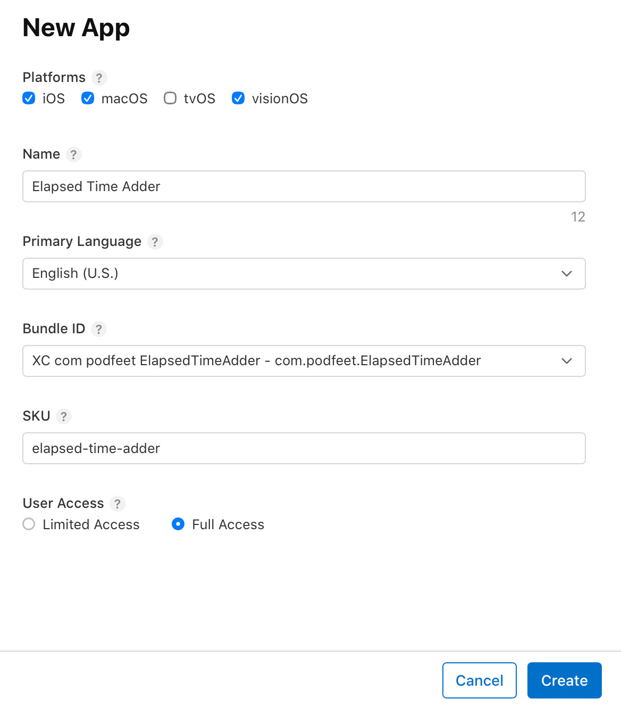

# App Store Submittal Notes

## Name & Bundle ID

Bundle ID: com.podfeet.ElapsedTimeAdder



## Example shown in screenshots

iPhone 17 Pro Max, iPhone 17e

Total s/b: 1 hr 26 min 39 sec

```Recording 1:23:45 (add) : "Intro/Outro" — 0:05:00 (add) : "Dead air" - 0:02:30 (subtract)
Recording    1:23:45
Intro/Outro  0:05:17
Dead air     0:02:23 (subtract)
```

iPad only, Landscape, showing "why not use a spreadsheet?"

Total s/b 1 hr 29 min 59 sec

```
Recording    1:23:45
Intro	       0:02:09
Outro        0:03:08
Dead air     0:02:23 (subtract)
Promo        0:03:20
```

## Text

### Promotional Text

> Promotional text lets you inform your App Store visitors of any current app features without requiring an updated submission. This text will appear above your description on the App Store for customers with devices running ios 11 or later, and macos 10.13 or later.


### Description

> A description of your app, detailing features and functionality.

Elapsed Time Adder runs on iOS, iPadOS, and macOS to help you add and subtract elapsed time. 

You might ask why not just use a spreadsheet for this? Sadly, while spreadsheets are great at doing calculations, they don't know how to work with elapsed time, only absolute time. Try adding 23 hours plus 7 hours in a spreadsheet — you won't get 30,  you'll get 6 (AM)!

If you need to add split times for running or walking, or keep track of time segments in audio or video recording, or time spent on projects, all of these efforts work great with ElapsedTimeAdder.

Enter the times in each row, along with an optional title for each row, and watch the total update automatically in a plain-language way (e.g. "1 hr 23 min 45 sec").

You can type 384.6 seconds, or 74 minutes, and Elapsed Time Adder will easily work with it. If you want to subtract a row, simply hit the +/- toggle, and you'll see the row turn from green to pink.

Use the "Add Another Row" button to have more rows in your calculations. If you're on a Mac or an iPad with a keyboard, hitting Tab at the end of the last second cell will add a new row too.

Want to start over? Use the Reset button, and you'll be back to the default number of rows, and they'll all be empty.

When you're finished, you can export your data to a CSV suitable for opening in a spreadsheet application, or you can get it in HH:MM:SS format along with the titles for each row. This will take you to the share sheet to send your output where you desire. Note that nothing is stored in a back-end system or in the cloud; all of your data is kept on-device only.

## Keywords

> Include one or more keywords that describe your app. Keywords make App Store search results more accurate. Separate keywords with an English comma, Chinese comma, or a mix of both.

time, elapsed time, time math, elapsed time calculator, add time, subtract time, elapsed time adder,

